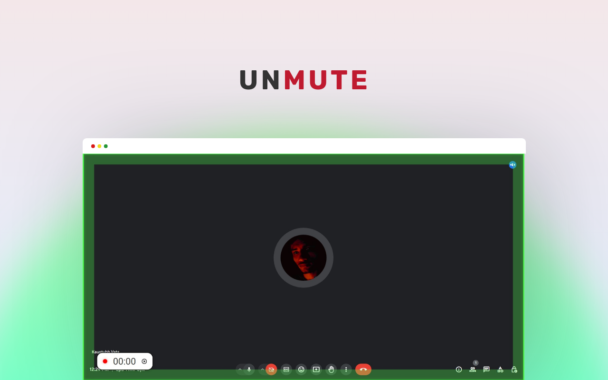
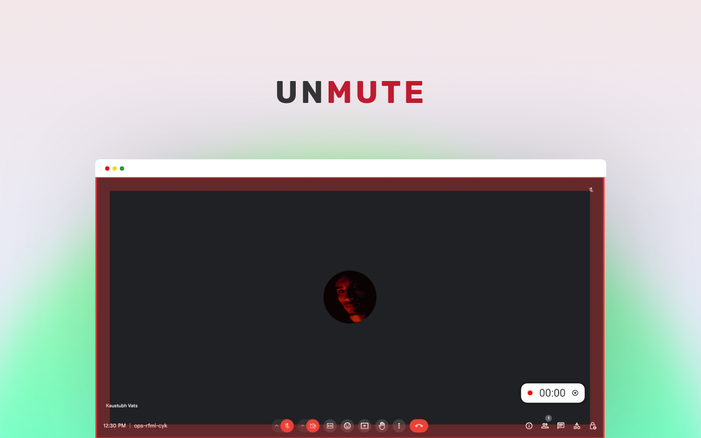
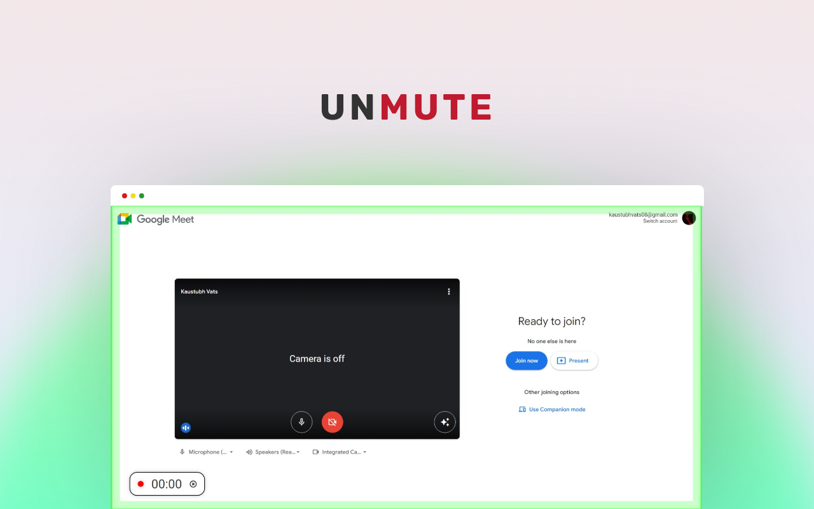
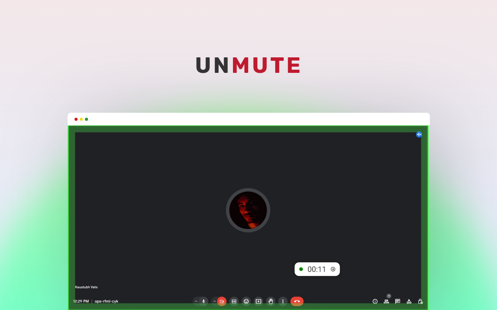

# Unmute Assistant

Unmute Assistant is a Chrome extension designed to simplify virtual meetings by providing a visual indicator of your mute status. No more "Sorry, I was on mute" moments – stay in control of your microphone with this focused and user-friendly tool.

## Features

- **Visual Mute Indicator:** A clear and bold visual cue ensures you never forget your mute status.
- **Timer Functionality:** Keep track of your speaking time with the built-in timer.
- **Seamless Integration:** Works seamlessly with popular video conferencing platforms, including Google Meet and Zoom.

## Installation

1. Visit the [Chrome Web Store](https://chrome.google.com/webstore) and search for "Unmute Assistant."
2. Click on the "Add to Chrome" button to install the extension.

## How to Use

1. After installation, join your virtual meeting on supported platforms.
2. The visual indicator will guide you – green for unmuted, red for muted.
3. Utilize the timer feature for effective time management during your meetings.

## Why Unmute Assistant?

- **Single Focus:** Unmute Assistant addresses the common issue of forgetting to unmute during virtual meetings.
- **Simplicity:** A straightforward solution without unnecessary features – making it easy for users to stay in control.

## Screenshots

*Green indicator means the person is unmute and speaking.*

*Green indicator means the person is unmute and speaking.*

*A custom timer draggable to anywhere in the screen.*

*A custom timer draggable to anywhere in the screen.*

## Contribution

Contributions are welcome! If you have ideas for new features or improvements, please open an issue or submit a pull request.
