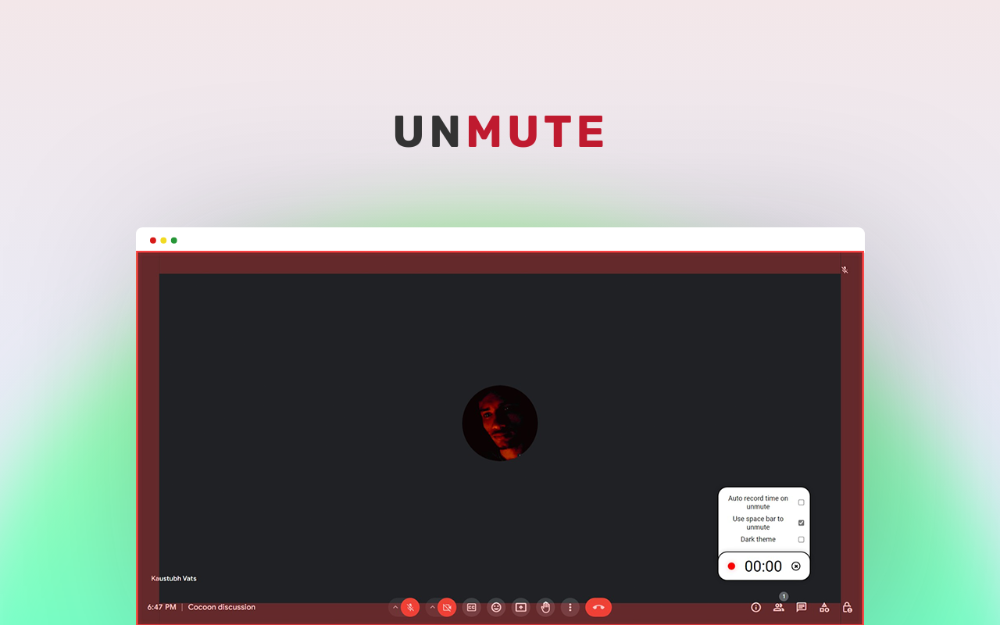

# Unmute Assistant

Unmute Assistant is a Chrome extension designed to simplify virtual meetings by providing a visual indicator of your mute status. No more "Sorry, I was on mute" moments – stay in control of your microphone with this focused and user-friendly tool.

## Features

- **Visual Mute Indicator:** A clear and bold visual cue ensures you never forget your mute status.
- **Timer Functionality:** Keep track of your speaking time with the built-in timer.
- **Seamless Integration:** Works seamlessly with popular video conferencing platforms, including Google Meet and Zoom.
- **Unmute with Space Bar:**You can now unmute yourself using the space bar! Simply press and hold the space bar to unmute your microphone. Release the space bar to mute yourself again. This feature offers a convenient way to control your audio status without needing to navigate through meeting controls.
- **Auto Time Record:**The auto time record feature automatically starts a timer when you begin speaking during a meeting. This allows you to keep track of the time you spend speaking, which can be useful for managing meeting discussions and ensuring equal participation among participants.
- **Dark Theme:**We've added a dark theme option for users who prefer a darker interface. The dark theme not only provides a sleek and modern look but also reduces eye strain, especially during meetings in low-light environments.

## Installation

1. Visit the [Chrome Web Store](https://chromewebstore.google.com/detail/unmute/imjeloehagbhnamhhkohgmiinafaeemo).
2. Click on the "Add to Chrome" button to install the extension.

## How to Use

1. After installation, join your virtual meeting on supported platforms (i.e. Google meet and zoom).
2. The visual indicator will guide you – green for unmuted, red for muted.
3. Utilize the timer feature for effective time management during your meetings.

## Why Unmute Assistant?

- **Single Focus:** Unmute Assistant addresses the common issue of forgetting to unmute during virtual meetings.
- **Simplicity:** A straightforward solution without unnecessary features – making it easy for users to stay in control.

## Screenshots

*Green indicator means the person is unmute and speaking.*

*Menu expanded for setting configs.*

*Red indicator means the person is on mute and speaking.*

*A custom timer draggable to anywhere in the screen.*

*A custom timer draggable to anywhere in the screen.*

## Contribution

Contributions are welcome! If you have ideas for new features or improvements, please open an issue or submit a pull request.
